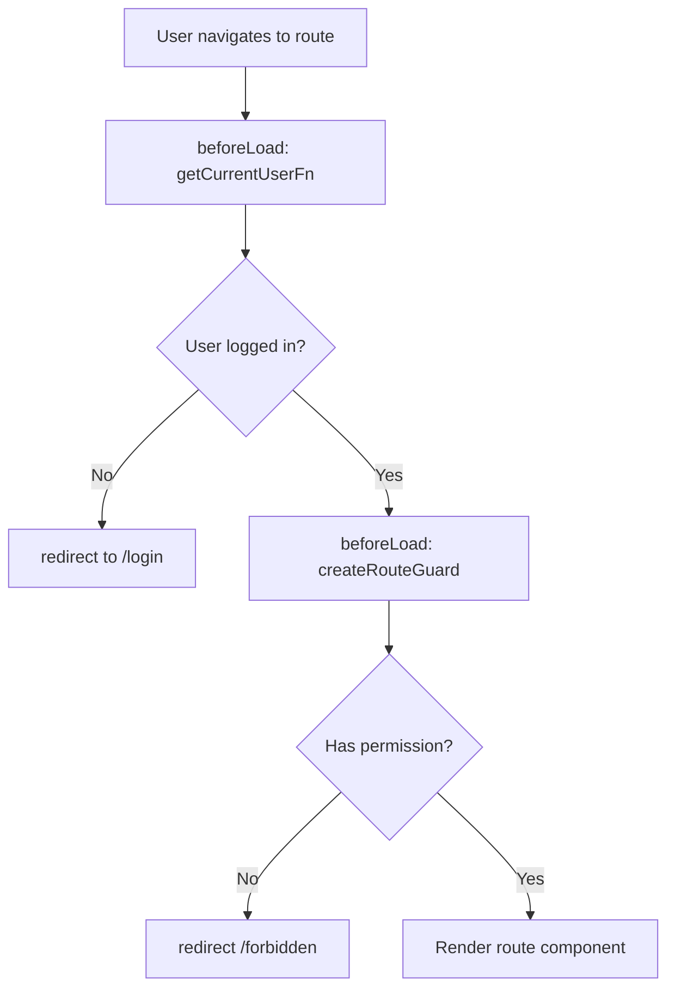

# Sprint 1: RBAC Implementation Design

## Overview

Implementasi Role-Based Access Control (RBAC) untuk DevSpace MVP. Scope mencakup backend enforcement, administration UI (Users CRUD + Roles management), dan route-level protection.

**Hypothesis:** User baru bisa login dan memilih project + environment dalam < 90 detik tanpa error, dengan RBAC yang melindungi semua operasi sensitif.

## Approach

Extend existing `app/modules/rbac/` + tambah `app/modules/users/` dan `app/modules/roles/` untuk presentation layer.

```
app/modules/rbac/
  domain/
    constants.ts          (existing)
    permission-service.ts (existing)
  infrastructure/
    permission-repository.ts (existing)
  server/
    require-permission.ts  (existing)
    middleware.ts          (NEW - route guard middleware)

app/modules/users/
  domain/
    user-service.ts        (NEW)
  infrastructure/
    user-repository.ts     (existing, extend)
  server/
    list-users.ts          (NEW)
    create-user.ts         (NEW)
    update-user.ts         (NEW)
    delete-user.ts         (NEW)
    change-user-role.ts    (NEW)
  presentation/
    users-table.tsx        (NEW)
    user-form-dialog.tsx   (NEW)
    role-select.tsx        (NEW)

app/modules/roles/
  domain/
    role-service.ts        (NEW)
  infrastructure/
    role-repository.ts     (NEW)
  server/
    list-roles.ts          (NEW)
    create-role.ts         (NEW)
    update-role.ts         (NEW)
    delete-role.ts         (NEW)
    list-permissions.ts    (NEW)
    update-role-permissions.ts (NEW)
  presentation/
    roles-table.tsx        (NEW)
    role-form-dialog.tsx   (NEW)
    permission-matrix.tsx  (NEW)
```

## Data Model

### Schema Changes (Migration 0001)

| Table | Change | Reason |
|-------|--------|--------|
| `roles` | + `updated_at timestamp` | Track when role/permissions last modified |
| `roles` | + `is_system boolean DEFAULT false` | Prevent delete/hardcode 3 default roles (admin/developer/viewer) |
| `permissions` | + unique constraint `(resource, action)` | Prevent duplicate permissions |
| `users` | + `updated_by uuid FK → users.id` | Track who last modified user (audit-ish) |

### Validation Rules
- Role name: unique, 3-50 chars, lowercase
- Permission: unique (resource, action) pair
- System roles: tidak bisa delete, tidak bisa rename

## Server Functions API

### Users Module

| Function | Method | Input | Output | Permission |
|----------|--------|-------|--------|------------|
| `listUsersFn` | GET | — | `User[]` | `users:read` |
| `createUserFn` | POST | `{ email, password, name, roleId }` | `{ success, userId }` | `users:create` |
| `updateUserFn` | POST | `{ id, email?, name?, roleId?, isActive? }` | `{ success }` | `users:update` |
| `deleteUserFn` | POST | `{ id }` | `{ success }` | `users:delete` |
| `changeUserRoleFn` | POST | `{ userId, roleId }` | `{ success }` | `users:update` |

### Roles Module

| Function | Method | Input | Output | Permission |
|----------|--------|-------|--------|------------|
| `listRolesFn` | GET | — | `Role[]` | `users:read` |
| `createRoleFn` | POST | `{ name, description }` | `{ success, roleId }` | `users:create` |
| `updateRoleFn` | POST | `{ id, name?, description? }` | `{ success }` | `users:update` |
| `deleteRoleFn` | POST | `{ id }` | `{ success }` | `users:delete` |
| `listPermissionsFn` | GET | — | `Permission[]` | `users:read` |
| `updateRolePermissionsFn` | POST | `{ roleId, permissionIds[] }` | `{ success }` | `users:update` |

## Middleware + Route Guard

### Route Guard Flow



### Route Permissions

| Route | Resource | Action |
|-------|----------|--------|
| `/administration/users` | users | read |
| `/administration/roles` | users | read |
| `/administration/audit-logs` | logs | read |
| `/projects` | projects | read |
| `/infrastructure` | environments | read |

## UI Components

### Users Page

**Table Columns:**
| Column | Filterable | Sortable |
|--------|------------|----------|
| Name | Yes | Yes |
| Email | Yes | Yes |
| Role | Yes | Yes |
| Status | Yes | Yes |
| Last Login | No | Yes |
| Actions | — | — |

### Roles Page

**Table Columns:**
| Column | Filterable | Sortable |
|--------|------------|----------|
| Name | Yes | Yes |
| Description | No | No |
| Permissions | No | No |
| Users | No | Yes |
| Actions | — | — |

### Permission Matrix

Interactive matrix dengan checkbox untuk setiap permission per role.

## PostHog Events

| Event | Properties | Trigger |
|-------|------------|---------|
| `admin_users_viewed` | — | Users page load |
| `admin_user_created` | `userId`, `roleId` | Create user success |
| `admin_user_updated` | `userId`, `fields` | Update user success |
| `admin_user_deleted` | `userId` | Delete user success |
| `admin_roles_viewed` | — | Roles page load |
| `admin_role_created` | `roleId` | Create role success |
| `admin_role_updated` | `roleId`, `fields` | Update role success |
| `admin_role_deleted` | `roleId` | Delete role success |
| `admin_permissions_updated` | `roleId`, `permissionCount` | Update permissions success |

## Definition of Done

- [ ] Users CRUD functional via UI
- [ ] Roles CRUD functional via UI
- [ ] Permission matrix editable per role
- [ ] Route guard protects all dashboard routes
- [ ] Server functions enforce permissions
- [ ] PostHog events tracking implemented
- [ ] `/forbidden` page for unauthorized access
- [ ] All tests pass (unit + integration)

## Risks

| Risk | Impact | Mitigation |
|------|--------|------------|
| TanStack Start middleware complexity | Medium | Start simple, iterate |
| Permission matrix UX | Medium | Keep it simple, clear labels |
| Database migration issues | High | Test migration on staging first |

## Future Improvements

- Audit log table for all RBAC changes
- Role templates for common use cases
- Permission inheritance
- API key authentication for programmatic access
