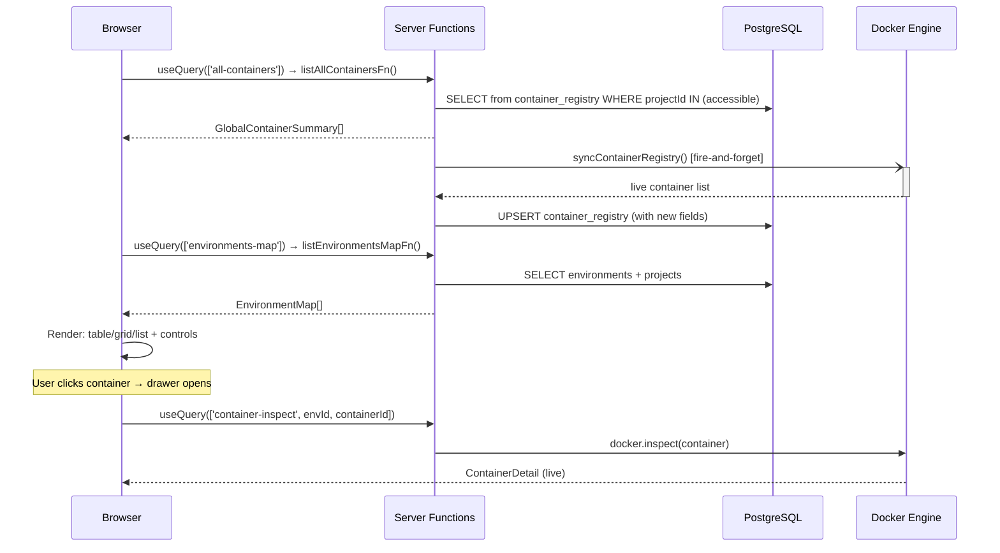

# Global Containers Page Enhancement Design

> Date: 2026-08-15
> Status: Approved
> Scope: Enhance `/containers` page with view-mode toggle (table/grid/list), controls (search, filter, bulk actions, group-by, column visibility), and detail drawer — re-implementing features from the env-specific containers page.

---

## 1. Context & Problem

### Current State

The global `/containers` page (`_dashboard.containers.tsx`) is a flat list with only a header and refresh button. It reads from `container_registry` (DB-backed) via `listAllContainersFn`, which returns `GlobalContainerSummary` — a limited shape with `name`, `image`, `state` (only `running`/`stopped`), `stackName`, `environmentId`, `projectId`.

The env-specific containers page (`_dashboard.configuration.projects.$projectId.environments.$environmentId.containers.tsx`) already has a full-featured UI:

- `ContainerSummaryBar` — filter pills (Total/Running/Stopped/Unhealthy)
- `ContainerTable` — TanStack Table with row selection, global search, sorting, state+health badges, ports, action buttons (start/stop/restart/remove with context-aware availability)
- `ContainerBulkToolbar` — bulk start/stop/restart/remove
- `ContainerDetailDrawer` — slide-out detail panel with live inspect data
- Auto-refresh via `listContainersFn` (live Docker Engine API)

### Data Gap

| Field | `GlobalContainerSummary` (DB) | `ContainerSummary` (Docker API) |
|---|---|---|
| `id` | ✅ | ✅ |
| `name` | ✅ | ✅ |
| `image` | ✅ | ✅ |
| `state` | `running`/`stopped` only | `running`/`exited`/`paused`/`restarting`/`dead` |
| `health` | ❌ | ✅ |
| `status` | ❌ | ✅ |
| `createdAt` | ❌ | ✅ |
| `ports` | ❌ | ✅ |
| `environmentId` | ✅ | N/A (implicit) |
| `projectId` | ✅ | N/A |
| `stackName` | ✅ | N/A |

### Decision (from brainstorming)

- **Data approach:** Expand `container_registry` schema — store `status`, `health`, `ports`, `dockerCreatedAt` in DB during sync. Page stays fast & DB-backed. Data may be stale a few seconds (acceptable for overview).
- **Component strategy:** Copy & adapt — re-use `ContainerTable`, `ContainerSummaryBar`, `ContainerBulkToolbar`, `ContainerDetailDrawer` with optional props for global mode. Minimal changes, maximum reuse.
- **View modes:** Table (default) + Grid cards + List compact.
- **Controls scope:** Enhanced — parity with env page + group by environment/project + column visibility toggle + saved view presets.
- **Detail format:** Detail drawer (slide-out), same as env page. Live-fetches inspect data from Docker Engine using `environmentId` from `GlobalContainerSummary`.

---

## 2. Schema & Data Layer

### 2.1 Expand `container_registry` table

New columns (all nullable/defaulted — backward compatible):

```sql
ALTER TABLE container_registry
  ADD COLUMN status           varchar(255),
  ADD COLUMN health           varchar(20) DEFAULT 'none' NOT NULL,
  ADD COLUMN ports            jsonb DEFAULT '[]' NOT NULL,
  ADD COLUMN docker_created_at timestamp with time zone;
```

Schema file (`app/shared/db/schema/container-registry.ts`):

```typescript
export const containerRegistry = pgTable(
  'container_registry',
  {
    // ...existing columns...
    status: varchar('status', { length: 255 }),
    health: varchar('health', { length: 20 }).default('none').notNull(),
    ports: jsonb('ports').default([]).notNull(),
    dockerCreatedAt: timestamp('docker_created_at', { withTimezone: true }),
  },
  (t) => [unique().on(t.containerId, t.environmentId)],
)
```

### 2.2 Update `syncContainerRegistry`

Extract new fields during sync loop using existing helpers from `docker-types.ts`:

```typescript
await upsertContainer({
  containerId: c.Id,
  name: (c.Names?.[0] ?? '').replace(/^\//, ''),
  image: c.Image,
  environmentId: env.id,
  projectId: env.projectId,
  stackName: c.Labels?.['com.docker.compose.project'] ?? null,
  isActive: true,
  // NEW fields:
  status: c.Status,
  health: normalizeHealth(c.Status ?? ''),
  ports: mapPorts(c.Ports),
  dockerCreatedAt: new Date(c.Created * 1000),
})
```

`normalizeHealth` and `mapPorts` already exist in `docker-types.ts` as local functions. They must be **exported** (add `export` keyword) so `sync-container-registry.ts` can import and re-use them. This is part of P1 scope.

### 2.3 Unify `GlobalContainerSummary` to extend `ContainerSummary`

```typescript
export interface GlobalContainerSummary extends ContainerSummary {
  environmentId: string
  projectId: string
  stackName: string | null
  lastSeenAt: string
}
```

`listAllContainersFn` mapping:

```typescript
return rows.map((r) => ({
  id: r.containerId,
  name: r.name,
  image: r.image,
  state: r.isActive ? 'running' : 'exited',
  health: r.health as ContainerHealth,
  status: r.status ?? '',
  createdAt: r.dockerCreatedAt?.toISOString() ?? r.lastSeenAt,
  ports: r.ports as string[],
  environmentId: r.environmentId,
  projectId: r.projectId,
  stackName: r.stackName,
  lastSeenAt: r.lastSeenAt.toISOString(),
}))
```

**Limitation:** `state` from DB is only `running`/`exited` (isActive boolean). Other states (`paused`, `restarting`, `dead`) are not persisted. Acceptable for MVP — sync runs on every list request, so state updates frequently. Can expand `isActive` → `state varchar(20)` in a future migration if needed.

### 2.4 Update `upsertContainer` in repository

Add new fields to `ContainerRegistryInsert` type and the upsert query in `container-registry-repository.ts`.

### 2.5 New server function: `listEnvironmentsMapFn`

```typescript
// app/modules/docker/server/list-environments-map.ts
export const listEnvironmentsMapFn = createServerFn({ method: 'GET' })
  .validator(z.object({}).optional())
  .handler(async () => {
    await requirePermission(RESOURCES.CONTAINERS, ACTIONS.READ)
    const projectIds = await findAccessibleProjectIds()
    const environments = await findEnvironmentsByProjectIds(projectIds)
    // Join with projects table to get projectName
    const uniqueProjectIds = [...new Set(environments.map((e) => e.projectId))]
    const projects = await db.select().from(projectsTable).where(inArray(projectsTable.id, uniqueProjectIds))
    const projectMap = new Map(projects.map((p) => [p.id, p.name]))
    return environments.map((e) => ({
      environmentId: e.id,
      environmentName: e.name,
      projectId: e.projectId,
      projectName: projectMap.get(e.projectId) ?? 'Unknown',
    }))
  })
```

---

## 3. Component Adaptation

### 3.1 ContainerTable — extended props

```typescript
interface ContainerTableProps {
  containers: ContainerSummary[]
  environmentId: string
  onOpenDetail: (c: ContainerSummary) => void
  onRefresh?: () => void
  // NEW: global mode extensions (all optional — env page unaffected)
  isGlobal?: boolean
  environments?: Map<string, { name: string; projectName: string }>
  viewMode?: 'table' | 'grid' | 'list'
  groupBy?: 'none' | 'environment' | 'project'
  columnVisibility?: Record<string, boolean>
  onColumnVisibilityChange?: (cols: Record<string, boolean>) => void
}
```

All new props are optional. When `isGlobal` is falsy, the component behaves exactly as before — env page is unaffected.

### 3.2 New columns (global mode only)

Table view adds 2 columns when `isGlobal=true`:

| Column | Position | Data source | Sorting |
|---|---|---|---|
| Environment | After Name | `environments.get(container.environmentId)?.name` | Yes |
| Project | After Environment | `environments.get(container.environmentId)?.projectName` | Yes |

Action buttons remain functional — `environmentId` per-container is available in `GlobalContainerSummary`, so mutations resolve the correct environment.

### 3.3 Grid view — ContainerGridCard

New component (`container-grid-card.tsx`). Card per container:

```
┌─────────────────────────────────┐
│ ● Running    [healthy]          │  state dot + health badge
│ container-name                  │  name (bold)
│ image:tag                       │  image (muted, mono)
│ env: production  proj: apotek   │  environment/project (small)
│ :8080→80  :443→443              │  ports badges
│ [Start] [Stop] [Restart] [Del]  │  quick actions (icon-only)
│ Created: 15 Aug 10:32           │  created date
└─────────────────────────────────┘
```

Grid layout: `grid-cols-1 md:grid-cols-2 lg:grid-cols-3 xl:grid-cols-4`

Glass styling: `rounded-[var(--glass-radius)] border border-[var(--glass-border)] bg-[var(--glass-surface)] backdrop-blur-[var(--glass-blur)]`

### 3.4 List (compact) view — ContainerListRow

New component (`container-list-row.tsx`). Single-line row:

```
● container-name  image:tag  Running  :8080  apotek/production  [▶■↻🗑]
```

Flex layout (not table). Dense overview. Hover: `bg-white/5`.

### 3.5 View-mode toggle — ContainerViewToggle

Segmented control with 3 icons (Table, Grid, List). Active: `bg-white/10 text-white border-[var(--glass-border-strong)]`. Inactive: `text-white/50`.

Persisted to `localStorage` key `devspace:containers:view-mode`.

### 3.6 Group-by control — ContainerGroupBy

Dropdown/select with options: None, Environment, Project.

When grouping is active, containers render with sticky group headers. Groups are collapsible.

Persisted to `localStorage` key `devspace:containers:group-by`.

### 3.7 Column visibility toggle — ContainerColumnToggle

Popover with checkbox list for each column. Unchecked = `hidden` class on column.

Persisted to `localStorage` key `devspace:containers:columns`.

### 3.8 ContainerDetailDrawer — unchanged

Re-used as-is from env page. `GlobalContainerSummary` extends `ContainerSummary` and includes `environmentId`, so the drawer can live-fetch inspect data:

```typescript
<ContainerDetailDrawer
  environmentId={selectedContainer.environmentId}
  container={selectedContainer}
  open={drawerOpen}
  onOpenChange={setDrawerOpen}
/>
```

No changes to the drawer component.

### 3.9 Re-used components (no changes)

| Component | Status |
|---|---|
| `ContainerSummaryBar` | Re-use as-is |
| `ContainerBulkToolbar` | Re-use as-is |
| `ContainerHealthBadge` | Re-use as-is |

---

## 4. Route & Page Composition

### 4.1 Page layout

```
┌──────────────────────────────────────────────────────────────────┐
│ Header: [Box] Containers                                [Refresh] │
│         Semua container lintas project & environment              │
├──────────────────────────────────────────────────────────────────┤
│ Controls: [Search...]  [Group: None▾] [Columns⚙] [Table|Grid|List]│
├──────────────────────────────────────────────────────────────────┤
│ Summary: [Total: 42] [Running: 28] [Stopped: 12] [Unhealthy: 2] │
├──────────────────────────────────────────────────────────────────┤
│ Bulk toolbar (when selected):                                     │
│ [3 selected]  [Start] [Stop] [Restart] [Remove]  [Clear]         │
├──────────────────────────────────────────────────────────────────┤
│ Container area (view-mode dependent)                              │
│                                                                   │
│ TABLE / GRID / LIST (rendered based on viewMode)                 │
│                                                                   │
│ GROUPED (if groupBy !== 'none'): sticky headers per group        │
└──────────────────────────────────────────────────────────────────┘
```

### 4.2 Data flow



### 4.3 State management

| State | Type | Persistence |
|---|---|---|
| `viewMode` | `'table' \| 'grid' \| 'list'` | `localStorage` |
| `groupBy` | `'none' \| 'environment' \| 'project'` | `localStorage` |
| `columnVisibility` | `Record<string, boolean>` | `localStorage` |
| `detailTarget` | `ContainerSummary \| null` | Session (in-memory) |
| `rowSelection` | `RowSelectionState` | Session (in-memory) |
| `globalFilter` | `string` | Session (in-memory) |
| `sorting` | `SortingState` | Session (in-memory) |

localStorage hydration happens in `useEffect` to avoid SSR mismatch. Server render uses default state.

### 4.4 Mutations

Re-use env page server functions. `environmentId` comes from `GlobalContainerSummary.environmentId`:

```typescript
startContainerFn({ data: { environmentId: container.environmentId, containerId: container.id } })
```

On success: invalidate `['all-containers']` query key.

### 4.5 Query invalidation

| Event | Action |
|---|---|
| start/stop/restart/remove success | `invalidateQueries(['all-containers'])` |
| Refresh button | `refetch(['all-containers'])` + fire-and-forget sync |
| Auto-refresh | `refetchInterval: 10000` (configurable, default off) |

### 4.6 Existing route `_dashboard.containers.$containerId.tsx`

Maintained for deep-link/inspect/logs access. The grid/table "show up detail" opens a drawer (in-place), not navigation to detail page — consistent with env page behavior.

---

## 5. UX Details

### 5.1 Visual design (glassmorphism)

| Element | Style |
|---|---|
| Card (grid) | `rounded-[var(--glass-radius)] border border-[var(--glass-border)] bg-[var(--glass-surface)] backdrop-blur-[var(--glass-blur)]` |
| List row | `border-b border-[var(--glass-border)]`, hover `bg-white/5` |
| Group header | `bg-white/5 border-[var(--glass-border)]`, sticky `top-0` |
| View toggle | Segmented: active `bg-white/10 text-white border-[var(--glass-border-strong)]`, inactive `text-white/50` |
| State dot | `size-2 rounded-full` — emerald (running), white/40 (exited), red (dead), amber (restarting) |
| Action buttons | Re-use `ACTION_BTN_CLASS` from container-table |

### 5.2 Interactions

| Action | Behavior |
|---|---|
| Click container row/card | Open detail drawer (slide-out right) |
| Click action button | Execute mutation, row/card shows spinner, invalidate `['all-containers']` |
| Select row (checkbox) | Bulk toolbar appears, individual action buttons remain visible |
| Select all | Header checkbox toggles all filtered rows |
| Search | Global filter in table mode; also filters grid/list mode |
| Group by | Re-render with sticky group headers, groups collapsible |
| View mode toggle | Smooth transition, state persisted to localStorage |
| Column toggle | Popover checkbox, unchecked = hidden column, persisted |
| Refresh | Spinner on button, `refetch()`, fire-and-forget sync |

### 5.3 Empty & error states

| State | Message |
|---|---|
| No containers | "Belum ada container terdaftar. Container akan muncul setelah di-deploy ke environment." |
| No results (filtered) | "Tidak ada container yang cocok dengan filter." + clear filter button |
| Error loading | Red panel: error message + retry button |
| Loading | Skeleton: 8 placeholder rows/cards with `animate-pulse` |

### 5.4 Responsive

| Breakpoint | Table | Grid | List |
|---|---|---|---|
| Mobile (<640px) | Horizontal scroll, hide Environment/Project/Ports columns | `grid-cols-1` | Full width, hide image |
| Tablet (640-1024px) | All columns, compact spacing | `grid-cols-2` | Full width |
| Desktop (>1024px) | Full table | `grid-cols-3` or `grid-cols-4` | Full width |

### 5.5 Keyboard shortcuts

| Shortcut | Action |
|---|---|
| `/` or `f` | Focus search input |
| `Esc` | Close drawer / popover / clear search |

---

## 6. File Structure & Migration Plan

### 6.1 Files changed

```
app/
├── shared/db/schema/
│   └── container-registry.ts              [MODIFIED] +4 columns
├── modules/docker/
│   ├── infrastructure/
│   │   └── container-registry-repository.ts [MODIFIED] upsert + new fields
│   ├── server/
│   │   ├── sync-container-registry.ts     [MODIFIED] extract status/health/ports/createdAt
│   │   ├── list-all-containers.ts         [MODIFIED] return GlobalContainerSummary extends ContainerSummary
│   │   └── list-environments-map.ts       [NEW] environments lookup for global page
│   ├── domain/
│   │   └── docker-types.ts               [MODIFIED] export normalizeHealth/mapPorts if not already exported
│   └── presentation/
│       ├── container-table.tsx            [MODIFIED] +isGlobal/+environments/+viewMode props, +Environment/Project columns
│       ├── container-grid-card.tsx        [NEW] grid card component
│       ├── container-list-row.tsx         [NEW] compact list row component
│       ├── container-view-toggle.tsx      [NEW] segmented control table/grid/list
│       ├── container-group-control.tsx     [NEW] group-by dropdown
│       ├── container-column-toggle.tsx     [NEW] column visibility popover
│       ├── container-summary-bar.tsx      [UNCHANGED] re-use as-is
│       ├── container-bulk-toolbar.tsx     [UNCHANGED] re-use as-is
│       ├── container-detail-drawer.tsx    [UNCHANGED] re-use as-is
│       └── container-health-badge.tsx     [UNCHANGED] re-use as-is
├── routes/
│   └── _dashboard.containers.tsx          [MODIFIED] full rewrite — compose all components
└── drizzle/                               [NEW MIGRATION] add columns to container_registry
```

### 6.2 Implementation phases

| Phase | Scope | Files | Verifiable outcome |
|---|---|---|---|
| P1: Schema & Sync | DB migration + sync update + types | schema, repository, sync, docker-types (export normalizeHealth/mapPorts), list-all-containers, migration | `drizzle-kit generate` + `drizzle-kit migrate` succeeds, sync writes new fields |
| **P2: Server fn** | `listEnvironmentsMapFn` | list-environments-map.ts | Query returns environment+project name map |
| **P3: Presentation** | 5 new components + adapt ContainerTable | container-table.tsx (modified), 5 new files | Type-check pass, manual render |
| **P4: Route rewrite** | Compose all in `_dashboard.containers.tsx` | route file | Page renders with all controls, 3 view modes, grouping, drawer |
| **P5: Polish** | localStorage persistence, error states, empty states, loading skeletons, responsive, keyboard shortcuts | route + presentation | UX parity with env page |

### 6.3 Migration commands

```bash
pnpm db:generate    # drizzle-kit generate — create migration SQL
pnpm db:migrate     # drizzle-kit migrate — apply to DB
```

### 6.4 Risk mitigations

| Risk | Mitigation |
|---|---|
| Migration in production | Backup DB before migrate. New columns are nullable/defaulted — backward compatible |
| Sync slow writing new fields | `normalizeHealth`/`mapPorts` are lightweight, no extra network calls |
| `state` only `running`/`exited` from DB | Documented limitation. Drawer live-fetches inspect for accurate state |
| Env page components break | New props are all optional (`isGlobal?`, `environments?`, `viewMode?`) — env page passes existing props |
| localStorage SSR mismatch | Hydrate in `useEffect`, default state for server render |

---

## 7. Trade-offs

| Aspect | Decision | Trade-off |
|---|---|---|
| DB-backed listing | Fast, no Docker API calls on page load | Data may be stale a few seconds (sync is fire-and-forget) |
| `state` limited to running/exited | Simpler DB schema (boolean isActive) | Cannot distinguish paused/restarting/dead in list view — drawer has full state via live inspect |
| Copy & adapt components | Maximum reuse, minimal duplication | ContainerTable props grow — some complexity in conditional rendering |
| Grid as card layout | Better visual scanning for many containers | Less information density than table |
| localStorage persistence | User preference survives reloads | No cross-device sync (acceptable for internal platform) |

---

## 8. Future Improvements

1. **Expand `isActive` → `state varchar(20)`:** Store full Docker state in DB for accurate list display
2. **WebSocket / SSE real-time sync:** Push container state changes to all connected clients instead of polling
3. **Saved view presets:** Let users save combinations of (viewMode, groupBy, columnVisibility, filters) as named presets
4. **Container stats:** CPU/memory usage per container (requires `docker.stats()` API)
5. **Bulk operations progress:** Progress indicator for bulk actions across multiple containers
6. **Cross-environment search:** Search containers by image name across all environments to find duplicates
